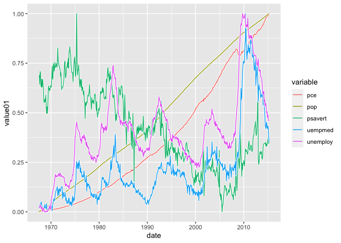
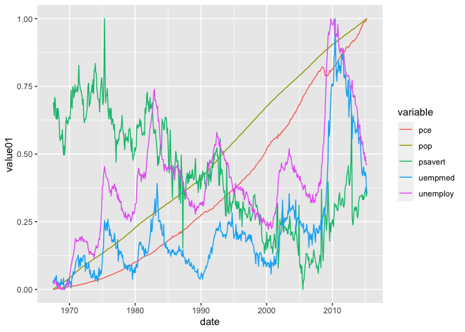
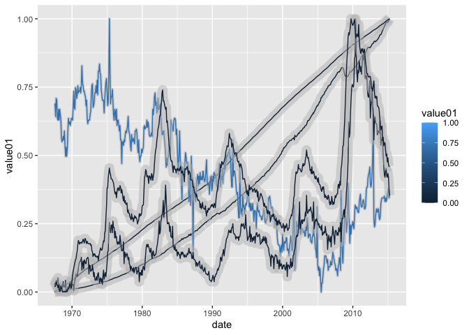
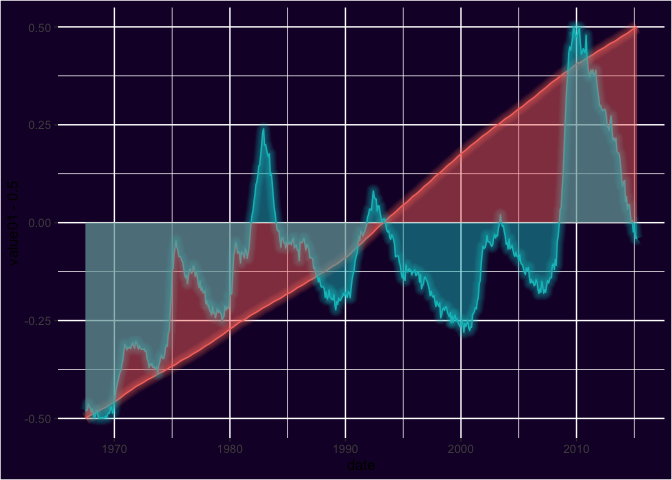

<!-- README.md is generated from README.Rmd. Please edit that file -->

# ggshadow

<!-- badges: start -->

[](https://CRAN.R-project.org/package=ggshadow)
[](https://www.gnu.org/licenses/old-licenses/gpl-2.0.en.html)
[](https://lifecycle.r-lib.org/articles/stages.html#stable)
<!-- badges: end -->

The goal of ggshadow is to provide shadow and glow geoms for points and
lines plots created with ‘ggplot2’.

## :arrow_double_down: Installation

You can install the development version of ggshadow from
[GitHub](https://github.com/) with:

``` r
# install.packages("devtools")
pak::pkg_install("marcmenem/ggshadow")
```

## :book: Vignette

``` r
## after installing the package
# vignette("ggshadow", package = "ggshadow")
```

## :chart: Example

### With ggshadow

``` r
library(ggplot2)
library(ggshadow)

ggplot(economics_long, aes(date, value01, colour = variable)) +
  geom_shadowline()
```



### Without ggshadow

``` r
ggplot(economics_long, aes(date, value01, colour = variable)) +
  geom_line()
```



### `ggshadow` supports varying the line color

``` r
ggplot(
  economics_long,
  aes(date, value01,
    group = variable,
    colour = value01,
    shadowlinewidth = 5 * (1 - value01)
  )
) +
  geom_shadowline(
    shadowcolour = "grey",
    shadowalpha = 0.5
  )
```



### `ggshadow` also provides a Neon glow style

``` r
ggplot(economics_long, aes(date, value01, color = variable)) +
  geom_glowline() +
  guides(color = "none") +
  theme(
    plot.background = element_rect(fill = "#190132"),
    panel.background = element_rect(fill = "#190132")
  )
```


### Neon glow points

``` r
ggplot(mtcars, aes(wt, mpg)) +
  geom_glowpoint(color = "yellow") +
  guides(color = "none") +
  theme(
    plot.background = element_rect(fill = "#190132"),
    panel.background = element_rect(fill = "#190132")
  )
```


### Adding a fill below the neon glow line

``` r
ggplot(
  economics_long[economics_long$variable %in% c("pop", "unemploy"), ],
  aes(date, value01 - 0.5, color = variable, fill = variable)
) +
  geom_glowline() +
  guides(color = "none", shadowcolour = "none", fill = "none") +
  theme(
    plot.background = element_rect(fill = "#190132"),
    panel.background = element_rect(fill = "#190132")
  )
```


