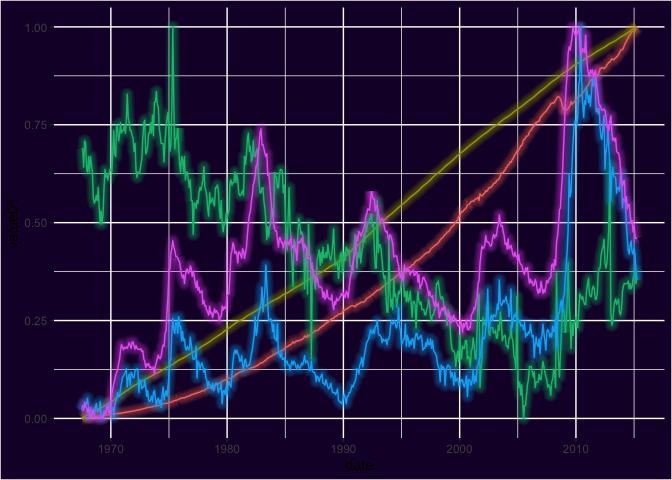
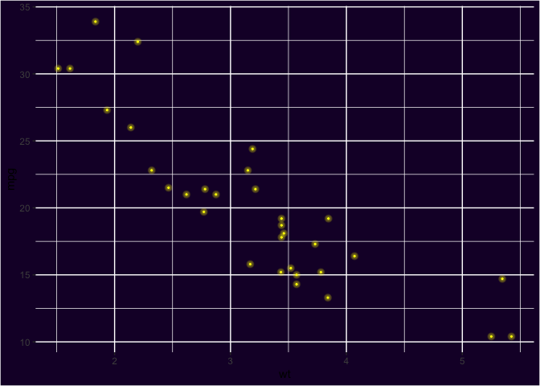

# ggshadow: Shadow Geoms for ggplot2


## :arrow_double_down: Installation


Get the development version from github:

```r
## install.packages("devtools")
devtools::install_github("marcmenem/ggshadow")
```


## :book: Vignette

```r
## after installing the package
vignette("ggshadow", package="ggshadow")
```

## :chart: Example

### With ggshadow

```{r}
library(ggplot2)
library(ggshadow)

ggplot(economics_long, aes(date, value01, colour = variable)) + geom_shadowline()

```


### Without ggshadow

```{r}
library(ggplot2)

ggplot(economics_long, aes(date, value01, colour = variable)) + geom_line()

```


### `ggshadow` also provides a Neon glow style

See vignette for example code.



